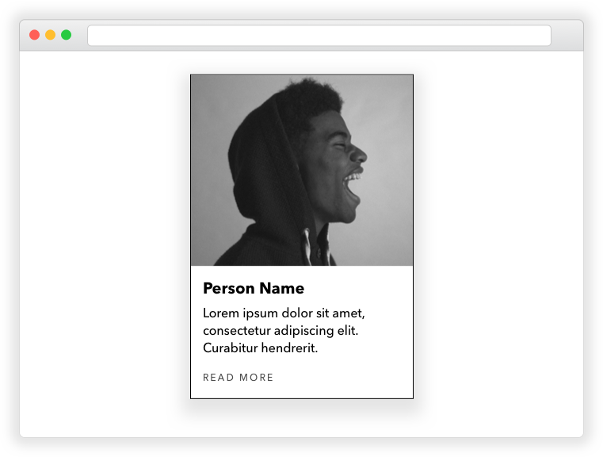

# Build a Card UI Element

Using HTML and CSS, build out a UI card based on the provided mock-up

## Prerequisites

* Semantic HTML
* Including an external CSS file
* Writing styleing rules in CSS

## Instructions

1. Fork and clone this repository.
1. Change into the new directory.
1. Fulfill the listed requirements.

Starter code is available in [`lib/`](lib/). You are not required to turn in
your submission.

## Requirements

The "card" is a common user interface element that you will see on many
webpages. A designer has given you one to build:

### Part 1: Structure

Working on your own or in a pair, work through the same steps from above:

1. Create a wireframe of the card
1. Create an outline for our HTML from your wireframe
1. Create an `index.html` inside the `lib/` directory
1. Build out the skeleton HTML inside `index.html`
1. Fill in the `body` element with the HTML for your card

### Part 2: Styling

Create a stylesheet inside the `lib/` directory and include it in your
`index.html`. Write the CSS rules needed to style the card so that it looks like
the one in the mock-up.

Note, you may have to research some declarations! Here are three really good CSS
references:

1. [cssreference.io](https://cssreference.io/)
1. [MDN CSS Properties
   Reference](https://developer.mozilla.org/en-US/docs/Web/CSS/CSS_Properties_Reference)
1. [Codrops CSS Reference](https://tympanus.net/codrops/css_reference/)

## Bonus: Naming CSS classes

Knowing what to name your CSS classes is tricky. You want something memorable
and semantic, but you also don't want to waste a lot of time coming up with
names for things. Because this is such a common problem, developers have come up
with conventions for how they name their CSS classes. One of the best and most
used conventions is called **BEM**, which stands for block, element, modifier.

Read the following two blog posts about BEM and then update your card to use the
BEM syntax.

1. [MindBEMding – getting your head 'round BEM syntax](https://csswizardry.com/2013/01/mindbemding-getting-your-head-round-bem-syntax/)
1. [BEM 101](https://css-tricks.com/bem-101/)

## [License](LICENSE)

1.  All content is licensed under a CC­BY­NC­SA 4.0 license.
1.  All software code is licensed under GNU GPLv3. For commercial use or
    alternative licensing, please contact legal@ga.co.
